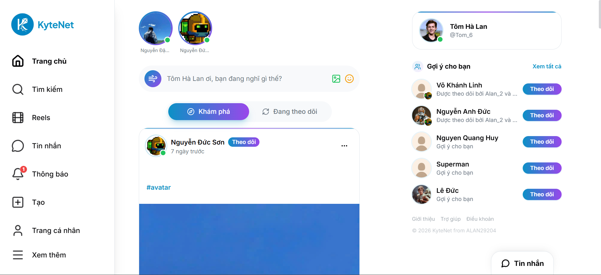
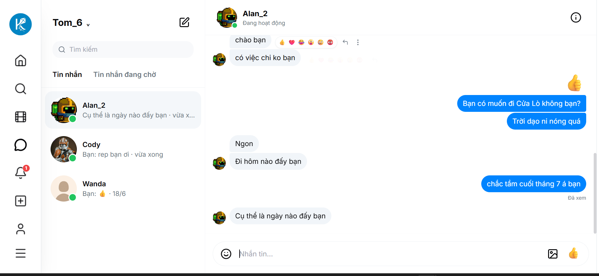

# 🌐 Social Network KyteNet

KyteNet là hệ thống mạng xã hội web được xây dựng theo mô hình client-server. Hệ thống hỗ trợ các chức năng chính như đăng bài viết, tương tác với bài viết, theo dõi người dùng, nhắn tin thời gian thực, thông báo, tìm kiếm nội dung, quản lý hồ sơ cá nhân và quản trị hệ thống.

## ✨ Giao diện

### 🏠 Bảng tin



### 👤 Trang cá nhân


### 💬 Nhắn tin



## 🧰 Công nghệ sử dụng

### ⚙️ Backend

- 🚀 NestJS
- 🐘 PostgreSQL
- 🧠 Redis
- 📬 BullMQ
- ⚡ Socket.IO
- 🗂️ SeaweedFS S3-compatible storage
- 🔗 TypeORM

### 🎨 Frontend

- ⚛️ ReactJS
- 🔷 TypeScript
- ⚡ Vite
- 🎨 Tailwind CSS
- 🔄 React Query
- 🔌 Socket.IO Client

### 🐳 Hạ tầng

- 🐳 Docker và Docker Compose
- 🐘 PostgreSQL container
- 🧠 Redis container
- 🗂️ SeaweedFS container

## 📁 Cấu trúc thư mục

```text
social-network-cnet/
├── core-api/              # Backend NestJS
├── user-interface/        # Frontend React/Vite
├── seaweedfs/             # Cấu hình SeaweedFS S3
├── docs/                  # Tài liệu và ảnh minh họa
├── docker-compose.yml     # Cấu hình các service hạ tầng
├── .env.example           # Mẫu biến môi trường cho Docker Compose
└── README.md
```

## ✅ Yêu cầu cài đặt

- 🟢 Node.js 20 hoặc mới hơn
- 📦 npm
- 🐳 Docker Desktop
- 🐘 PostgreSQL và 🧠 Redis nếu chạy backend không qua Docker

## 🔐 Cấu hình môi trường

Tạo các file `.env` từ file mẫu:

```bash
cp .env.example .env
cp core-api/.env.example core-api/.env
cp user-interface/.env.example user-interface/.env
```

Trong đó:

- `.env`: dùng cho `docker-compose.yml` ở thư mục gốc.
- `core-api/.env`: dùng khi chạy backend NestJS trong thư mục `core-api`.
- `user-interface/.env`: dùng cho frontend Vite, chỉ chứa các biến có tiền tố `VITE_`.

Với frontend local, cấu hình mặc định:

```env
VITE_API_URL=http://localhost:3000
VITE_MEDIA_URL=http://localhost:3000
```

## 🐳 Chạy hạ tầng bằng Docker

Tại thư mục gốc dự án, chạy:

```bash
docker compose up -d
```

Lệnh này khởi động các service hạ tầng gồm PostgreSQL, Redis và SeaweedFS. File `seaweedfs/s3.json` được dùng để cấu hình tài khoản truy cập S3-compatible storage cho SeaweedFS, phục vụ upload ảnh/video trong hệ thống.

## ⚙️ Chạy backend

```bash
cd core-api
npm install
npm run start:dev
```

Backend mặc định chạy tại:

```text
http://localhost:3000
```

## 🎨 Chạy frontend

```bash
cd user-interface
npm install
npm run dev
```

Frontend mặc định chạy tại:

```text
http://localhost:5173
```

## 🚀 Build production

### ⚙️ Backend

```bash
cd core-api
npm run build
npm run start:prod
```

### 🎨 Frontend

```bash
cd user-interface
npm run build
npm run preview
```

## 🧩 Một số chức năng chính

- 🔐 Đăng ký, đăng nhập, đổi mật khẩu và quản lý hồ sơ cá nhân.
- 📝 Đăng bài viết với nội dung văn bản, ảnh/video, hashtag và gắn thẻ người dùng.
- ❤️ Tương tác với bài viết thông qua thả cảm xúc, bình luận, lưu bài viết và đăng lại.
- 🤝 Theo dõi, hủy theo dõi, xử lý yêu cầu theo dõi và chặn người dùng.
- 📰 Xem bảng tin theo dõi và bảng tin khám phá.
- 🔎 Tìm kiếm người dùng, bài viết và hashtag.
- 💬 Nhắn tin cá nhân, nhắn tin nhóm và cập nhật tin nhắn theo thời gian thực.
- 🔔 Nhận thông báo về tương tác, theo dõi và các hoạt động liên quan.
- 🛡️ Quản trị người dùng, bài viết và báo cáo vi phạm.

## 📝 Ghi chú

- 🔒 Không commit các file `.env` chứa thông tin thật.
- 🔄 Khi thay đổi API backend, có thể cần sinh lại client API cho frontend bằng lệnh `npm run gen:api` trong `user-interface`.
- 🗂️ SeaweedFS cần file `seaweedfs/s3.json` để backend có thể upload và đọc ảnh/video qua giao thức S3.
